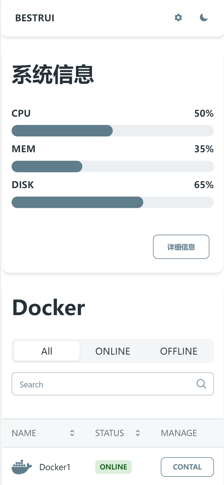
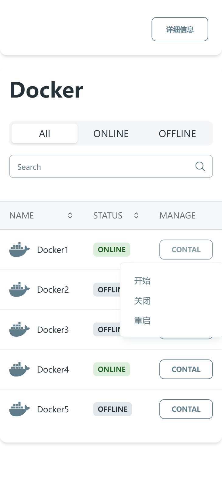

# MY DASH

> 因为找了好久都没有找到一个自己满意的面板，所以准备自己做一个 
>> 只是显示服务器信息和对docker容器进行一些简单的操作

> 目前只完成了前端，后端进度0%   
> 前端使用`material-tailwin`组件库，这个UI深得我心  
> 在这之前自己并未学习过react相关知识，所以这个项目是否能成功完成是个悬念🙏欢迎大佬帮忙


## 🎈帮助我完成此项目的开发 
 
1 ✨ 安装依赖  

```
npm i
```
2 🎉 启动   
 ```
 npm start
 ```

## PREVIEW
       




